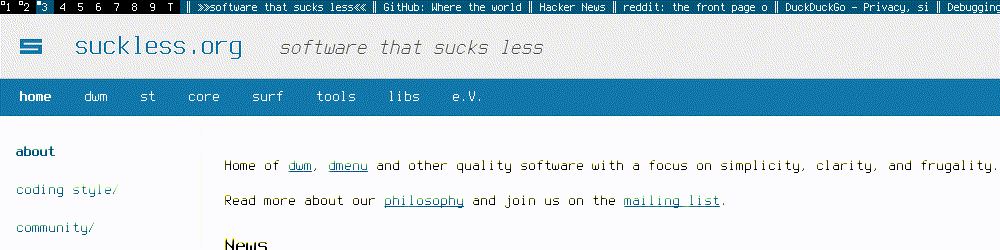

# Use dwm bar as firefox tab bar when you go kiosk mode or full-screen mode.
## https://addons.mozilla.org/en-US/firefox/addon/tabs-in-title/

If you use a high resolution screen maybe you need to patch dwm to allow more characters like this patch
https://gist.github.com/edvardxyz/598417868b38662d171398f374e8af32
